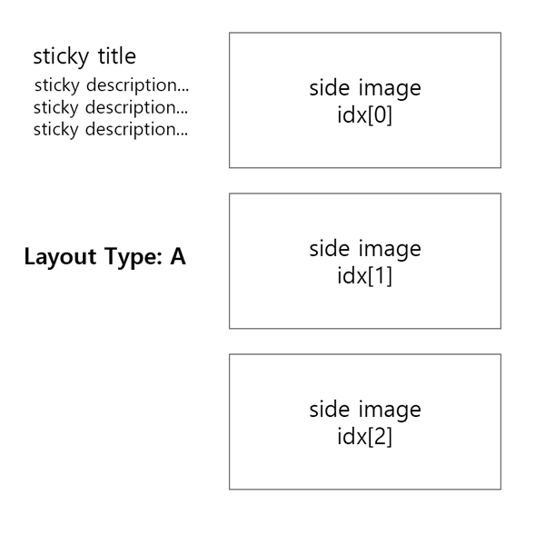
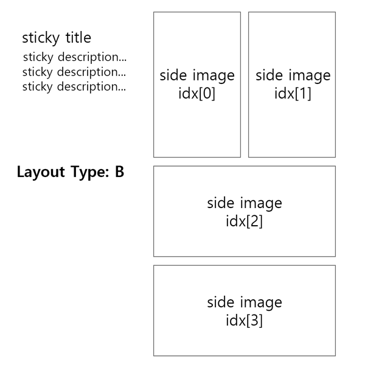

<!-- AUTO-GENERATED-CONTENT:START (STARTER) -->
<p align="center">
  <a href="https://www.thetelos.net">
    
  </a>
</p>
<h1 align="center">
  TELOS Branding Homepage
</h1>

> 제작자 - 이소망

> 제작일 - 2023년 05월

> 프레임워크 - Gatsby.js

> 스타일 - tailwind css

## 🚀 시작

1.  **NPM 설치**

    최초 clone 또는 pull 시 프로젝트내 모든 라이브러리 및 플러그인들이 yarn 으로 적용되었음으로 yarn 을 설치. (작성자는 Git Bash 활용)

    ```shell
    # yarn 또는 yarn install
    yarn
    yarn install
    ```

2.  **프로젝트 실행**

    로컬 서버로 프로젝트 실행 후 수정 or 추가사항 적용 실시간 확인

    ```shell
    # 이외 각종 yarn 스크립트 옵션들은 root 경로 package.json 에서 확인
    yarn start
    ```

3.  **로컬 서버**

    디폴트 로컬 서버 링크는 `http://localhost:8000` 입니다.

    두번째 링크는 `http://localhost:8000/___graphql` 이며.

    해당 링크를 통해 GraphQL로 호출할 Data의 옳바른 쿼리 문법을 확인할수 있습니다.

    보다 상세한 정보는 공식문서 [Gatsby Tutorial](https://www.gatsbyjs.com/docs/tutorial/part-4/#use-graphiql-to-explore-the-data-layer-and-write-graphql-queries) 을 참고 바랍니다.

&nbsp;

---

&nbsp;

## 🧐 루트 폴더링 구조

- **`/root` 경로 폴더 구조**

      .
      ├── contents
      ├── node_modules
      ├── public
      ├── source-file-assets
      ├── src
      ├── static
      ├── gatsby-browser.js
      ├── gatsby-config.js
      ├── gatsby-node.js
      ├── package.json
      ├── tailwind.config.js
      └── tsconfig.json

&nbsp;

1.  **`/contents`**: 포트폴리오 페이지에 표시될 컨텐츠가 존재하며, `/src/templates` 경로지에 있는 템플릿으로 생성됩니다.

        .contents
        └── portfolio
            ├── telos-???
            ├── telos-???
            └── telos-???
                ├── assets
                ├── item-1.md
                └── item-2.md

    - **portfolio** - 포트폴리오 템플릿 생성시 폴더 명을 slug로 호출 하여 쿼리스트링으로 적용하기 위해, 해당 폴더 하위에 md 등록.

    - **telos-???** - 각 **`폴더 명은`** 뉴스 아이템이 템플릿으로 생성시 url 쿼리스트링 (slug)으로 적용됩니다. 예) `www.thetelos.net/telos-???/item-title`

    - **assets** - 각개 폴더 내부 assets 폴더는 해당 폴더내의 item 들만 사용할 asset을 보관하고있습니다.

    - **item-1.md** - 각개 폴더 내부 **`마크다운 파일`** 은 해당 폴더 명의 쿼리스트링 (slug)를 이어받는 실질적인 뉴스 상세정보이며 `src/templates` 로 호출되어 상세페이지를 생성합니다.

&nbsp;

2.  **`/node_modules`**: 프로젝트가 의존하는 모든 모듈 코드가 보관됩니다. (npm 손댈일 없음)

3.  **`/public`**: 프로젝트 빌드 후 해당 경로로 빌드본 생성.

4.  **`/source-file-assets`**: GraphQL로 호출하여 사용될 assets을 보관하며 주로 gatsbyImage를 활용하기 위해 보관됩니다.

5.  **`/src`**: 모든 마크업, 스타일, 스크립트가 작성되어있으며 수정 사항 필요시 해당 폴더 경로로 작업.

6.  **`/static`**: 프로젝트내 사용되는 모든 폰트를 보관합니다.

7.  **`gatsby-browser.js`**: `/src`내의 모든 프론트엔드 컴포넌트를 감쌓는 역할을 하여 전역상태 관리에 쓰이는 RecoilRoot와 같은 로직이 적용되어있습니다.

    자세한 내용은 공식문서 [Gatsby browser APIs](https://www.gatsbyjs.com/docs/reference/config-files/gatsby-browser/)를 참고 바랍니다.

8.  **`gatsby-config.js`**: 프로젝트의 메타데이터, 플러그인(라이브러리)들을 작성합니다. 자세한 내용은 공식문서 [config docs](https://www.gatsbyjs.com/docs/reference/config-files/gatsby-config/)를 참고 바랍니다.

9.  **`gatsby-node.js`**: `/src`내부 폴더들을 커스텀 경로로 등록하는 로직과, `/src/templates`가 `/contents`의 md파일을 호출하는 로직이 구현되어있습니다.

    더 자세한 내용은 공식문서 [Gatsby Node APIs](https://www.gatsbyjs.com/docs/reference/config-files/gatsby-node/)를 참고바랍니다.

10. **`package.json`**: 프로젝트의 메타데이터 설정, 프로젝트내 설치된 라이브러리 및 플러그인의 정보, yarn 스크립트를 확인 및 수정 할수있습니다.

11. **`tailwind.config.js`**: 프로젝트내 사용될 유틸리티 클래스인 tailwindcss를 (커스텀) 설정하는 컨피그 파일입니다.

12. **`tsconfig.json`**: 프로젝트내 사용될 typescript를 설정하는 컨피그 파일입니다.

&nbsp;

---

&nbsp;

## 🧐 소스 폴더링 구조

- **`/src` 경로 폴더 구조**

      .src
      ├── assets
      ├── components
      ├── hooks
      ├── pages
      ├── store
      ├── styles
      ├── templates
      └── types

## &nbsp;

1.  **`/assets`**: 상대경로로 호출하여 사용 하는 정적 assets을 보관합니다.

2.  **`/components`**: 특정 페이지 전용과 전체 공용 콤퍼넨트가 작성 되어있습니다.

3.  **`/hooks`**: 프로젝트내 사용하는 커스텀 훅이 작성되어있으며, 주로 `<gatsbyImage/>`를 위한 GraphQL 이미지 호출 훅들이 작성되어있습니다.

4.  **`/pages`**: `/components` 에서 불러온 콤포넌트들의 집약체이며 페이지 단위의 대형 콤퍼넌트가 작성되어있습니다.

    - **게츠비 특성**: `/pages` 경로에 작성한 index 콤포넌트는 자동으로 라우팅 설정이 되며

      `www.thetelos.net/???` 경로로 탐색할수있습니다.

5.  **`/store`**: 전역 상태관리를 담당하는 `Recoil`의 초기 설정 및 저장고가 작성되어있습니다.

6.  **`/styles`**: 프로젝트내 전역 공용 스타일 파일이 등록되어있습니다.

7.  **`/templates`**: 포트폴리오 페이지 목록의 상세 페이지를 담당하는 마크다운 템플릿입니다.

    - **`재사용성`**: `/contents` 내부에 있는 마크다운 파일을 호출하여 `/templates` 규격에 찍어내는 로직은 `gatsby-node.js` 에 작성되어있습니다.

8.  **`/types`**: 전역 공용으로 사용할 typescript 의 타입 지정 파일이 작성되어있습니다.

&nbsp;

---

&nbsp;

## 🎓 마크다운 작성 안내문

- **마크다운 양식**

  ```shell
  ---
  layoutType: 'A'
  date: '2023-05-22'
  title: 'F.E.O.'
  categories: ['Brand eXperience']
  description: '실시간 체험형 비대면 교육 플랫폼 Face Each Other'
  stickyTitle: '홍보물 디자인'
  stickyDescription: '실시간 체험형 비대면 교육 플랫폼'
  thumbnail: './assets/FEO/feo_banner.png'
  bannerImage: './assets/FEO/feo_banner.png'
  sliderImage: ['./assets/FEO/feo_slider_01.png', './assets/FEO/feo_slider_02.png', './assets/FEO/feo_slider_03.png']
  sideImage: ['./assets/FEO/feo_side_01.png', './assets/FEO/feo_side_02.png', './assets/FEO/feo_side_03.png']
  bottomImage: './assets/FEO/feo_bottom.png'
  ---

  ```

1. **`layoutType`**: 사이드 이미지 레이아웃의 타입 지정 (가변성 구조). - <span style="color:skyblue">string</span>

   - 

   - 

1. **`date`**: 게시글 작성일 - <span style="color:skyblue">string</span>

1. **`title`**: 게시글 제목 - <span style="color:skyblue">string</span>

1. **`category`**: 게시글 카테고리 - <span style="color:skyblue">string array</span>

   - 카테고리 `명칭`은 작성중인 마크다운 파일이 속한 `부모 폴더` 명과 동일하게 작성하셔야, 관리가 편합니다.

   - 웹 디자인/기획 설계상 `1개` 이상의 카테고리는 필요하지 않습니다.

   - 추후 1개 이상의 카테고리를 지정할수있도록 `배열`로 설계하였습니다.

1. **`description`**: 게시글 상단 설명 내용 - <span style="color:skyblue">string</span>

1. **`sticky title`**: 하단 사이드 이미지 좌측에 붙어있는 부가 설명 제목. - <span style="color:skyblue">string</span>

1. **`sticky description`**: 하단 사이드 이미지 좌측에 붙어있는 부가 설명 내용. - <span style="color:skyblue">string</span>

1. **`thumbnail`**: 게시글 썸네일 이미지 - <span style="color:skyblue">string 상대 경로</span>

1. **`banner image`**: 게시글 베너 이미지 - <span style="color:skyblue">string 상대 경로</span>

1. **`slider image`**: 게시글 슬라이더 이미지 - <span style="color:skyblue">배열 string 상대 경로</span>

   - 슬라이더 이미지가 단 1개만 필요하더라도 (배열) 로 이미지 호출.

1. **`side image`**: 게시글 하단 사이드 이미지 - <span style="color:skyblue">배열 string 상대 경로</span>

   - 사이드 이미지의 layout 에 따라 받아야하는 이미지의 갯수가 fixed 로 정해저있습니다.

   - type: A - 3개의 이미지

   - type: B - 4개의 이미지

1. **`bottom image`**: 게시글 최하단 이미지 - <span style="color:skyblue">string 상대 경로</span>
